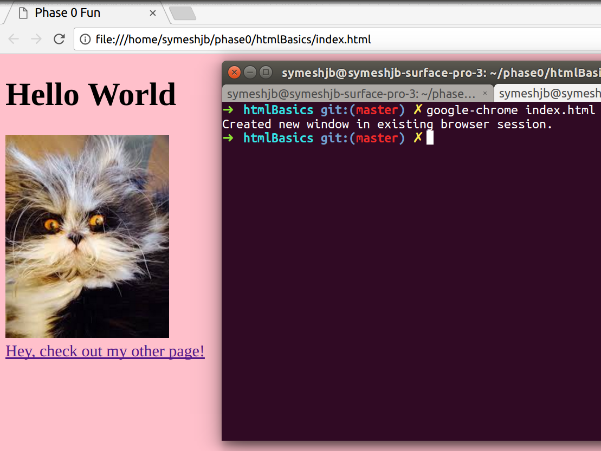
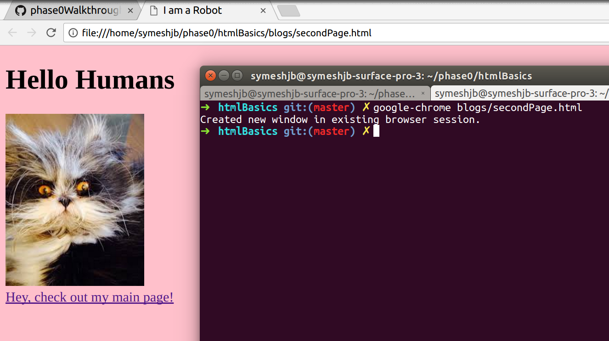

# CSS / Stylesheet Basics

- By Harrison Symes for EDA phase 0 students
- Helpful for Sprint 1, task 1.3

#### Links
  - [Create a Stylesheet](#creating-a-stylesheet)
  - [Link a Stylesheet](#linking-a-stylesheet)
    - [Link Stylesheet to a Blog Page](#linking-into-a-blog)

---

### Creating a stylesheet
  * Make a file called `style.css`
    * This is where you will define the styling of your web page
  * A nice way to easily check for when our stylesheet is working properly is to give a nice bold background colour. Paste this code into the `style.css` file:

``` css
  body {
    background-color: pink;
  }
```

  * We will be able to tell that our styles are being applied as soon as we see the white background become that lovely pixel pink :smile:
    * The `body` selector means that any style properties we put in the enclosing `{}`'s will be applied to any elements within the `<body>` tags, which in this case, is all the content on your page
    * The structure of assigning a style property is `PROPERTY-NAME: PROPERTY_VALUE`;
    * Notice the `:` in the middle, and the `;` at the end, these are important!

  * Our page is currently not using this stylesheet, so now we need to link them together

---

### Linking a stylesheet
  * To link in a stylesheet, we will be using as selfclosing `<link />` tag (believe it or not) in the head of our html. This means we place this tag between the opening `<head>` and the closing `</head>`

```html
<head>
  <meta charset="utf-8">
  <title>Phase 0 Fun</title>
  <link  /> <!-- Here -->
</head>
```

  Like so ^

  * Now we need to define what we are linking in, we do this by giving our `<link />` some attributes
  * The attributes are the following:
    * `rel="stylesheet"` to tell it we are linking in a stylesheet
    * `type="text/css"` to describe the language of the stylesheet we are linking in
    * `href="./style.css"` to state the path to the file we are locating in. This will change based on the relative path to your stylesheet from the page you are linking it into, but the other two attributes won't be changing.
  * Your code should now look like this:

```html
<head>
  <meta charset="utf-8">
  <title>Phase 0 Fun</title>
  <link rel="stylesheet" type="text/css" href="./style.css" />
</head>
```

  * I added this to my `index.html` page, so I am going to run `google-chrome index.html` in my terminal so that I can view my page in Chrome, and hopefully I will see that lovely pink background.



  ##### B-E-A-utiful

  ---

  ### Linking into a blog

  * Now that my styles are working for my index page, I want to add the same stylesheet to my secondPage. My second page however, is located inside a `blogs` directory (folder), so I can't use the same relative path.

      harrison-symes.github.io
      * index.html
      * style.css
      * /blogs
        * secondPage.html

  * ^^ This is what my file structure looks like, my `secondPage.html` is inside my `/blogs` directory
  * All this means is that the relative path to `style.css` from my `secondPage.html` will be `../style.css`, rather than the previous `./style.css`, as we need to go back one directory with `../`

```html
<link rel="stylesheet" type="text/css" href="./style.css" />
```



  ---

  ---
  
### Thanks for reading, hope this was helpful for you!
#### If something wasn't clear enough for you, or you have other general feedback, send me a slack message @harrison_eda
